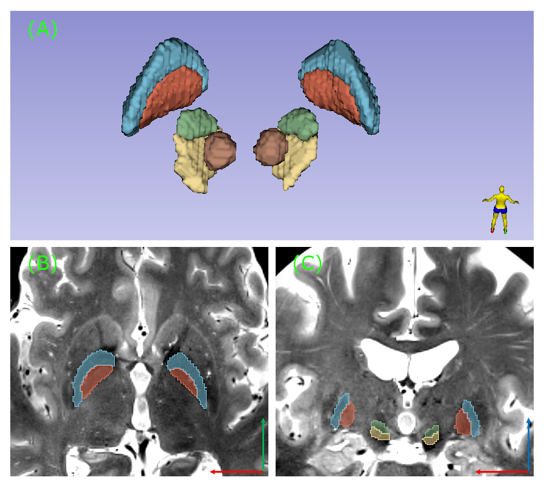

### GP/STN-nets: Deep-learning based segmentation of subcortical deep brain stimulation targets
This is a PyTorch implementation for GP-net [1] and STN-net [2]. Both networks are attention gated U-nets, forked from the authors of [3] and [4], which are further augmented with 3D deformable convolutions (https://github.com/KrakenLeaf/deform_conv_pytorch). GP-net was trained on 7 Tesla (T) T2 axial slab scans and corresponding manual segmentations of both compartments of the globus pallidus (GP) to achieve accurate and reliable segmentation for clinical applications such as deep brain stimulation. STN-net was trained on 7 T T2 coronal slabs to segment the subthalamic nucleus (SN), substantia nigra (SN) and the red nucleus. If you are using this code, please cite [1] and [2].

      
    <em> Dice score comparison for GP-net and selected state-of-the-art atlas based segmentations.</em>

### How to work with the code
* NOTE: This is not a comprehensive guide on how to use the code, as the program is given "as is" according to the attached license.
* Main training script: train_segmentation.py. Requires a configuration file (can be found in the scripts folder).
Usage: python train_segmentation.py --config configs/config_unet_onlu_gp.json
* Main evaluation scripts: validation_gpe_gpi.py for GP-net and validation_stn_sn_rn for STN-net. Requires a configuration file (can be found in the scripts folder).
Usage: python validation_gpe_gpi.py --config checkpoints/experiment_unet_ct_dsv_mri_gpe94/config_unet_only_gp.json
Remember to set the "isTrain" flag to false and "which_epoch" variable to be the epoch number for the saved network name (i.e. 94 for the network parameters saved in "094_net_S.pth").
* The configuration json file containts several training related flags and is relatively self explenatory. "data_path" is the name of the database over which we train. This folder (e.g. "db") should have three subfolders: "train", "test" and "validation" (for the evaluation scripts we can also use a folder named "test_val" for joint inference on both test and val folders). Each of these folders should contain a "label" and "image" subfolders. Within each of the "image" folders, the corresponding images should be stored in nifti format. In the label folder, corresponding nifti segmentation files should be stored (per each scan, a single nifti file containing all labels should exist). Keep in mind that there should be a 1-to-1 correspondance between the images and labels, so the same naming convention should be used to avoid confusion (e.g. P0.nii.gz, P1.nii.gz,...).
For example:
--my_db_folder
	|--test
		|--image
			|--P0.nii.gz
			|--P1.nii.gz
		|--label
			|--P0.nii.gz
			|--P1.nii.gz
and similarly for "test", "val" or "test_val" (technically, these names can be changed within the code). Typically, pre-processing will include image/labels interpolation to an isotropic resolution grid and cropping to the same input size, for ease of use.

### References:
1) Solomon O, Palnitkar T, Patriat R, et al. Deep-learning based fully automatic segmentation of the globus pallidus interna and externa using ultra-high 7 Tesla MRI. Hum Brain Mapp. 2021;1–18. https://doi.org/10.1002/hbm.25409   
2) Solomon O, Palnitkar T, Patriat R, et al., "STN/GP-nets: Fully automatic deep-learning based segmentation for DBS applications using ultra-high 7 Tesla MRI", International Society for Magnetic Resonance in Medicine (ISMRM) 2021
3) "Attention-Gated Networks for Improving Ultrasound Scan Plane Detection", MIDL'18, Amsterdam  
4) "Attention U-Net: Learning Where to Look for the Pancreas", MIDL'18, Amsterdam  

### Requirements (not a comprehensive list)
* [PyTorch-v1.4.0](http://pytorch.org/docs/1.4.0/) and above
* Torchsample 0.1.3 and above
* Nibabel 3.0.0 (only for the example) and above
* Numpy 1.15.4 (only for the example) and above

### License 
* MIT License

Copyright (c) 2020

Permission is hereby granted, free of charge, to any person obtaining a copy of this software and associated documentation files (the "Software"), to deal in the Software without restriction, including without limitation the rights to use, copy, modify, merge, publish, distribute, sublicense, and/or sell copies of the Software, and to permit persons to whom the Software is furnished to do so, subject to the following conditions:

The above copyright notice and this permission notice shall be included in all copies or substantial portions of the Software.

THE SOFTWARE IS PROVIDED "AS IS", WITHOUT WARRANTY OF ANY KIND, EXPRESS OR IMPLIED, INCLUDING BUT NOT LIMITED TO THE WARRANTIES OF MERCHANTABILITY, FITNESS FOR A PARTICULAR PURPOSE AND NONINFRINGEMENT. IN NO EVENT SHALL THE AUTHORS OR COPYRIGHT HOLDERS BE LIABLE FOR ANY CLAIM, DAMAGES OR OTHER LIABILITY, WHETHER IN AN ACTION OF CONTRACT, TORT OR OTHERWISE, ARISING FROM, OUT OF OR IN CONNECTION WITH THE SOFTWARE OR THE USE OR OTHER DEALINGS IN THE SOFTWARE.

