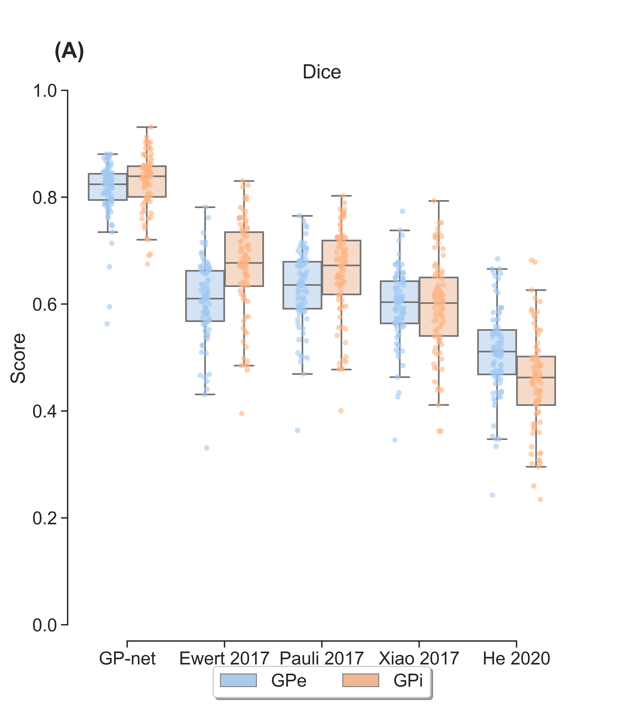

### GP-net: Deep-learning based segmentation of the globus pallidus interna and externa
This is a PyTorch implementation for GP-net [1]. GP-net is an attention gated U-net, forked from the authors of [2] and [3], which is further augmented with 3D deformable convolutions (https://github.com/KrakenLeaf/deform_conv_pytorch). GP-net was trained on 7 Tesla (T) T2 scans and corresponding manual segmentations of both compartments of the globus pallidus (GP) to achieve accurate and reliable segmentation for clinical applications such as deep brain stimulation. 

      
    <em> Dice score comparison for GP-net and selected state-of-the-art atlas based segmentations.</em>

### How to work with the code
* NOTE: This is not a comprehensive guide on how to use the code, as the program is given "as is" according to the attached license.
* Main training script: train_segmentation.py. Requires a configuration file (can be found in the scripts folder).
Usage: python train_segmentation.py --config configs/config_unet_onlu_gp.json
* Main evaluation script: validation.py. Requires a configuration file (can be found in the scripts folder).
Usage: python validation.py --config checkpoints/experiment_unet_ct_dsv_mri_gpe94/config_unet_onlu_gp.json
Remember to set the "isTrain" flag to false and "which_epoch" variable to be the epoch number for the saved network name (i.e. 94 for the network parameters saved in "094_net_S.pth").
* The configuration json file containts several training related flags and is relatively self explenatory. "data_path" is the name of the database over which we train. This folder (e.g. "db") should have three subfolders: train, test and validation. Each of these folders should contain a label an image subfolders. Within each of the "image" folders, the corresponding images should be stored in nifti format. In the label folder, corresponding nifti segmentation files should be stored (per each scan, a single nifti file containing all labels should exist). Keep in mind that there should be a 1-to-1 correspondance between the images and labels, so the same naming convention should be used to avoid confusion (e.g. P0.nii.gz, P1.nii.gz,...).

### References:
1) Oren Solomon et. al., "Deep-learning based fully automatic segmentation of the globus pallidus interna and externa using ultrahigh 7 Tesla MRI", Human Brain Mapping, 2021   
2) "Attention-Gated Networks for Improving Ultrasound Scan Plane Detection", MIDL'18, Amsterdam  
3) "Attention U-Net: Learning Where to Look for the Pancreas", MIDL'18, Amsterdam  

### Requirements
* [PyTorch-v1.4.0](http://pytorch.org/docs/1.4.0/)
* Nibabel 3.0.0 (only for the example)
* matplotlib 3.1.1 (only for the example)
* Numpy 1.15.4 (only for the example)

